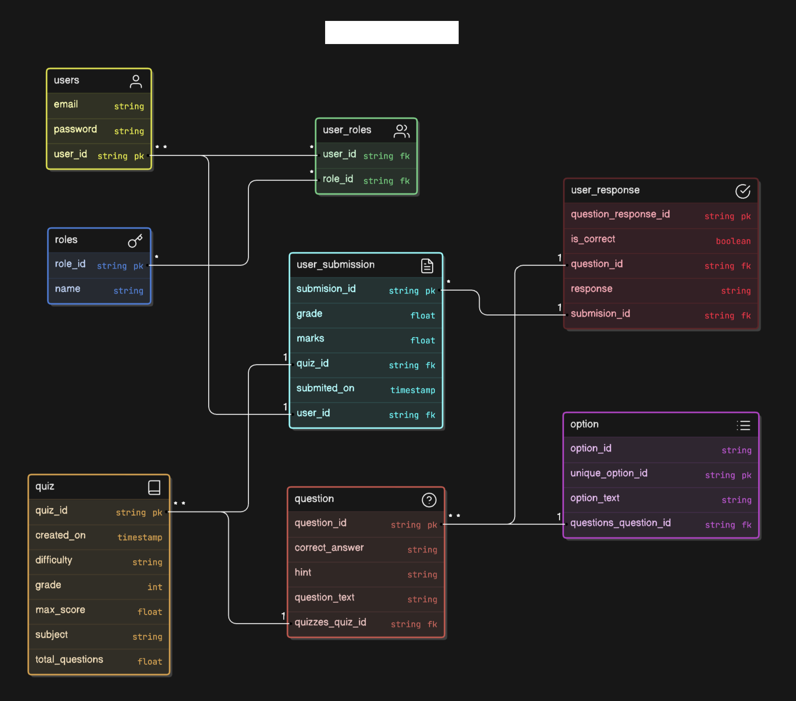

# AI Quizzer


## Features

- **User Authentication**: JWT-based authentication with role-based access control.
- **Quiz Management**:
    - Generate quizzes using AI.
    - Submit quizzes and evaluate answers.
    - Retrieve quiz history and results based on grade, subject, completion date and date duration.
- **AI-powered hints**: Provides AI-generated hints for quiz questions.
- **Caching**: Redis caching for optimized performance.
- **Email Notifications**: Send suggestion via email with improvement suggestions (AI-powered).
- **Scalable Deployment**: Dockerized application for easy deployment on cloud platforms.

## Technologies Used

- **Backend**: Spring Boot, Spring Data JPA, Spring Security
- **Database**: PostgreSQL, Redis 
- **Authentication**: JWT (JSON Web Tokens)
- **AI Integration**: OpenAI llama3-70b-8192 API for quiz generation and hints and suggestions
- **Deployment**: Docker, 
- **Email Notifications**: SMTP (Gmail)

## Getting Started

### Prerequisites

Ensure you have the following installed:
- Java 17
- PostgreSQL
- Redis
- Docker 
- Maven 

## Running the Project

```bash
cd Quizzer
```
```bash
docker-compose up
```


## API Endpoints
#### User Endpoints
- POST /user/auth: Authenticate user and return JWT token.

#### Quiz Endpoints
- POST /quiz/create:  Create a new AI-generated quiz.
- GET /quiz/getByQuizId: Retrieve quiz by quiz ID.
- POST /quiz/submit: Submit quiz answers and get results.
- GET /quiz/byUser: Retrieve quizzes by the current user.
- GET /quiz/byGrade: Retrieve quizzes filtered by grade.
- GET /quiz/bySubject: Retrieve quizzes filtered by subject.
- GET /quiz/byCompletedDate: Retrieve quizzes filtered by completion date.
- GET /quiz/byCompletedDateRange: Retrieve quizzes filtered by a date range.
- GET /quiz/hint: Get AI-generated hints for a question.

## Documentation

You can find detailed API documentation [here](https://documenter.getpostman.com/view/27597906/2sAXjRWVTP).


## Docker Deployment

## ER Diagram


